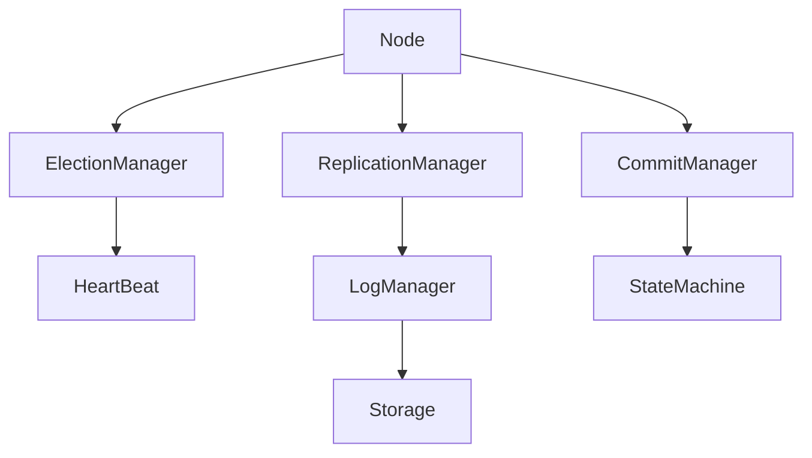

# Consensus Engine

## Diagram



## Raft Node

Coordinates all Raft components.
it maintains Node state and contains refrences to all the components


## Node State

```
Persistent state on all servers
--------------------------------
currentTerm
votedFor
log[] --- ours will be handled by log manager

Volatile state on all servers
-----------------------------
commitIndex
lastApplied

Volatile state on leaders
-------------------------
nextIndex[]
matchIndex[]
```

refrence: https://raft.github.io/raft.pdf

## Election Manager

Responsible for Leader Election
 
-Start Elections
-Request vote
-Count vote
-Become Leader
-Become Follower

### Heartbeat Manager

Responsible for randomized timer ticks to keep leader alive and followers active

## Log Manager

Contains Log Entry it's related methods and functions and also handles persistant log storage

### Methods

#### RulesforServers

- Append(entry) ---Ifcommandreceivedfromclient:appendentrytolocallog, respondafterentryappliedtostatemachine(§5.3)

#### AppendEntriesRPC

- AppendEntries(entries) ---Appendanynewentriesnotalreadyinthelog
- DeleteFrom(index) ---Ifanexistingentryconflictswithanewone(sameindex butdifferentterms),deletetheexistingentryandallthat followit(§5.3)
- Get(index) ---Ifanexistingentryconflictswithanewone(sameindex butdifferentterms),deletetheexistingentryandallthat followit(§5.3)

#### RequestVoteRPC

- LastIndex
- LastTerm

Entries() ---for multiple entries
IsUpToDate() ---log matching


### Log Entry

Term    |   Log Index   | Command
---------------------------------
8 bytes |   8 bytes     | []byte