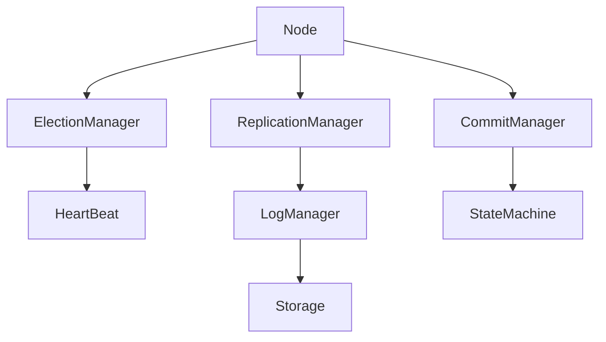

# Consensus Engine

## Diagram



## Raft Node

Coordinates all Raft components.
it maintains Node state and contains refrences to all the components


## Node State

```
Persistent state on all servers
--------------------------------
currentTerm
votedFor
log[]

Volatile state on all servers
-----------------------------
commitIndex
lastApplied

Volatile state on leaders
-------------------------
nextIndex[]
matchIndex[]
```

refrence: https://raft.github.io/raft.pdf

## Election Manager

Responsible for Leader Election
 
-Start Elections
-Request vote
-Count vote
-Become Leader
-Become Follower

### Heartbeat Manager

Responsible for randomized timer ticks to keep leader alive and followers active
